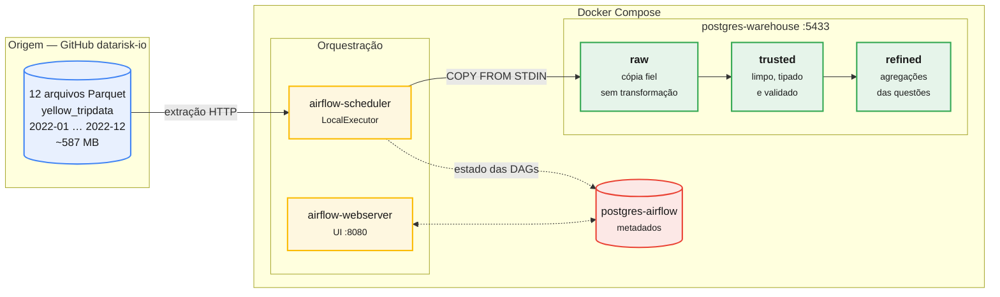
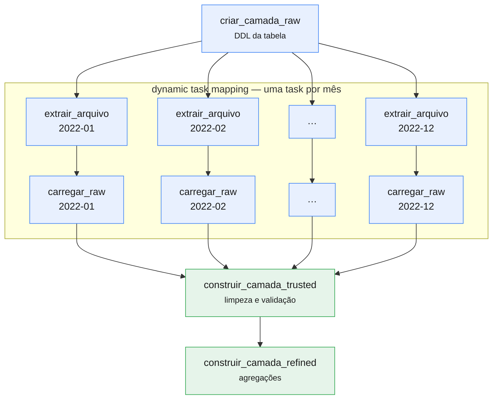
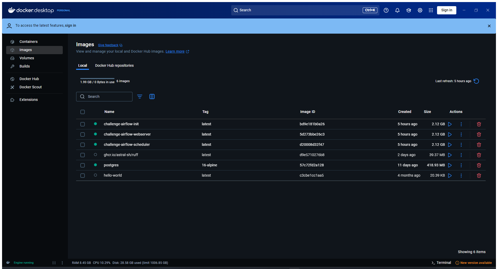
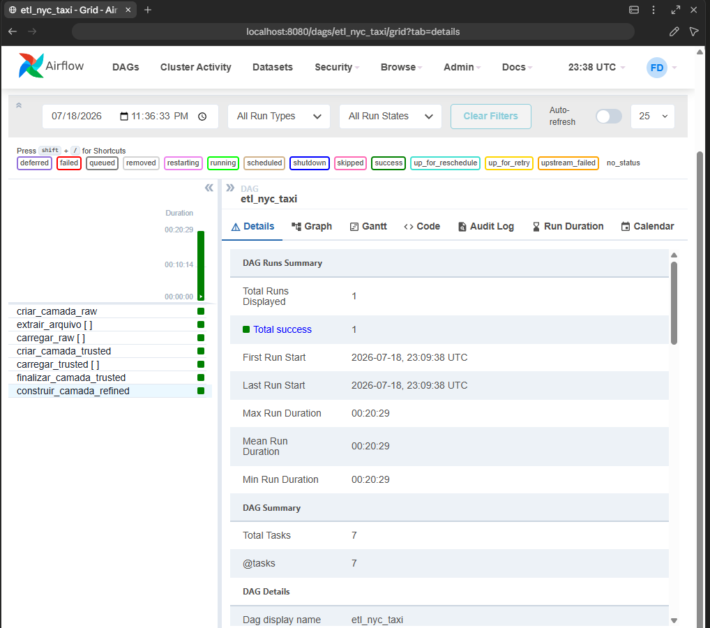
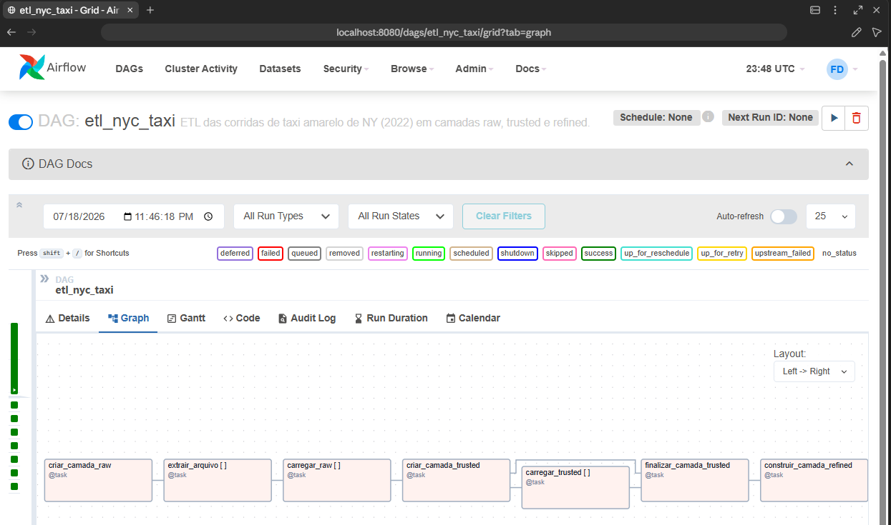
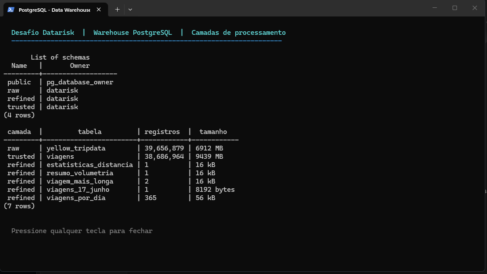
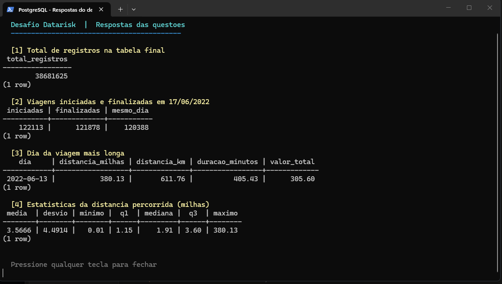

# Desafio de Engenharia de Dados — Datarisk

Pipeline de ETL das corridas de táxi amarelo de Nova York (ano de 2022),
orquestrado em Apache Airflow e armazenado em PostgreSQL, com os dados
organizados em três camadas de processamento.

---

## Sumário

- [Arquitetura](#arquitetura)
- [Como executar](#como-executar)
- [O pipeline](#o-pipeline)
- [Decisões de projeto](#decisões-de-projeto)
- [Respostas às questões](#respostas-às-questões)
- [Problemas encontrados](#problemas-encontrados)
- [Estrutura do repositório](#estrutura-do-repositório)

---

## Arquitetura



Quatro containers no total. Dois bancos PostgreSQL separados, deliberadamente:
um para os metadados do Airflow e outro para o data warehouse. Misturar os dois
acoplaria o ciclo de vida da orquestração ao dos dados — reinstalar o Airflow
não deve colocar o warehouse em risco.

### As três camadas

| Camada    | Conteúdo                                             | Transformação |
|-----------|------------------------------------------------------|---------------|
| `raw`     | Cópia fiel dos arquivos de origem                    | Nenhuma       |
| `trusted` | Dados limpos, tipados e validados                    | Limpeza e tipagem |
| `refined` | Agregações que respondem às questões                 | Agregação     |

A camada `raw` não rejeita nenhum registro, nem mesmo os absurdos. Isso é
proposital: quando um número da `refined` parece errado, é possível descer até
a `raw` e comparar com o dado original sem baixar os arquivos de novo.

---

## Como executar

### Pré-requisitos

- Docker e Docker Compose
- ~20 GB livres em disco
- Virtualização habilitada na BIOS (`SVM Mode` em CPUs AMD, `VT-x` em Intel) —
  sem isso o WSL2 não inicia e o Docker não sobe

### Passos

```bash
cd challenge

# Sobe a stack (o primeiro build leva alguns minutos)
docker compose up -d

# Acompanha até os containers ficarem saudáveis
docker compose ps
```

A interface do Airflow fica em <http://localhost:8080> — usuário `airflow`,
senha `airflow`. O warehouse fica exposto em `localhost:5433` para inspeção via
`psql` ou DBeaver.

```bash
# Dispara o pipeline
docker compose exec airflow-scheduler airflow dags unpause etl_nyc_taxi
docker compose exec airflow-scheduler airflow dags trigger etl_nyc_taxi
```

Ao final, as respostas das questões:

```bash
docker compose exec postgres-warehouse \
  psql -U datarisk -d nyc_taxi -f /opt/airflow/sql/05_respostas.sql
```

---

## O pipeline

A DAG `etl_nyc_taxi` tem quatro etapas:



As etapas de extração e carga usam **dynamic task mapping** (`.expand()`): o
Airflow cria uma task por mês em tempo de execução. Isso dá granularidade de
reprocessamento — se apenas o arquivo de março falhar, só essa task precisa ser
reexecutada, não o ano inteiro.

A carga é **idempotente**: antes de inserir, cada task remove os registros do
seu próprio arquivo de origem (`DELETE ... WHERE arquivo_origem = ...`).
Reexecutar uma task não duplica dados.

---

## Decisões de projeto

### LocalExecutor em vez de CeleryExecutor

O `docker-compose.yaml` oficial do Airflow sobe oito serviços com
CeleryExecutor: webserver, scheduler, triggerer, worker, flower, redis, postgres
e init. Para uma carga em lote numa máquina só, isso é custo de memória sem
contrapartida — Celery existe para distribuir tarefas entre máquinas, e aqui só
há uma. O LocalExecutor paraleliza em subprocessos do próprio scheduler e
entrega o mesmo resultado com metade dos containers.

### `COPY FROM STDIN` em vez de `pandas.to_sql()`

Com ~39 milhões de registros, o método de carga é a decisão de performance mais
importante do projeto. `to_sql()` gera INSERTs; `COPY` é o caminho nativo de
carga em massa do PostgreSQL.

Medido nesta máquina: **~80.000 linhas/s** com `COPY`, contra ~49.000 linhas/s
na primeira versão. A carga completa do ano leva cerca de 8 minutos.

Houve também um motivo técnico: o pandas 2.2 exige SQLAlchemy ≥ 2.0, enquanto o
Airflow 2.9 fixa SQLAlchemy < 2.0. Nesse cenário o pandas ignora o SQLAlchemy
silenciosamente, trata o `Engine` como conexão DBAPI e falha com
`'Engine' object has no attribute 'cursor'`. Usar `psycopg2` diretamente resolve
o conflito e ainda entrega a carga mais rápida.

### Leitura do parquet em lotes

Os arquivos maiores passam de 3,5 milhões de linhas. `pq.ParquetFile.iter_batches()`
lê em lotes de 100 mil registros, mantendo o consumo de memória previsível em
vez de materializar o arquivo inteiro.

### Lógica de carga fora do decorador `@task`

A função `carregar_parquet_em_raw()` é uma função de módulo, e a task é apenas
um wrapper fino sobre ela. Lógica dentro do decorador só roda com um contexto de
Airflow montado, o que torna qualquer teste caro. Como função de módulo, ela é
importável e testável isoladamente.

### A chave sintética da camada trusted, e um sort que custou caro

O dataset de origem não traz identificador de viagem, então a `trusted.viagens`
gera um `viagem_id` próprio. A primeira versão usava:

```sql
ROW_NUMBER() OVER (ORDER BY tpep_pickup_datetime, pu_location_id, do_location_id)
```

O `ORDER BY` força a ordenação completa das ~39 milhões de linhas. Medido em
execução: **2,5 GB de arquivos temporários** em disco e vários minutos de merge
externo, com o processo consumindo mais de 5 GB de RAM. Numa máquina de 16 GB
isso contribuiu para travar o host.

A versão final usa `ROW_NUMBER() OVER ()`, sem ordenação. A chave continua única
e estável; perde-se apenas a correlação entre a ordem do id e a linha do tempo —
que nenhuma consulta deste projeto usa, já que a ordenação cronológica vem de
`datahora_inicio`, que é indexada.

A lição vale além deste projeto: `ORDER BY` dentro de uma window function sobre
tabela grande é uma ordenação total disfarçada de detalhe cosmético.

### Critérios de limpeza da camada trusted

O dataset público do NYC TLC é notoriamente sujo. Cada filtro aplicado na
`trusted` tem uma justificativa registrada em [`sql/03_trusted.sql`](sql/03_trusted.sql):

| # | Critério | Motivo |
|---|----------|--------|
| 1 | Datas de embarque e desembarque não nulas | Sem elas a viagem não é localizável no tempo |
| 2 | Desembarque posterior ao embarque | Há registros que produziriam duração negativa |
| 3 | Embarque dentro de 2022 | Existem registros com datas de 2001, 2008 e até 2098 |
| 4 | Distância maior que zero | Zero indica corrida cancelada ou erro de taxímetro |
| 5 | Distância até 1.000 milhas | Há valores como 389.678 milhas — defeito de hodômetro |
| 6 | Duração entre 1 minuto e 24 horas | Descarta taxímetro esquecido ligado por dias |
| 7 | Valor total não negativo | Valores negativos são estornos, não corridas |

O filtro 5 merece atenção: as questões 3 e 4 são justamente sobre distância, e
sem esse corte a resposta seria dominada por um registro defeituoso. O limite de
1.000 milhas é generoso o bastante para preservar viagens interestaduais
legítimas.

**Nenhum desses registros é perdido** — todos continuam na camada `raw`. A taxa
de descarte é medida e registrada em log a cada execução.

---

## Execução

Registros da execução real do pipeline nesta máquina.

### Containers em execução

Os quatro serviços do `docker-compose` de pé: webserver e scheduler do Airflow,
o Postgres de metadados e o Postgres do warehouse. O `airflow-init` aparece
encerrado porque roda apenas uma vez, aplicando as migrações e criando o usuário
administrador.



### DAG no Airflow

Execução completa: **40 tasks concluídas com sucesso em 20 minutos e 29 segundos**
(1 criação da raw + 12 extrações + 12 cargas raw + 1 criação da trusted + 12
cargas trusted + 1 finalização + 1 refined).



O grafo do pipeline, com os grupos `[ ]` indicando as tasks geradas
dinamicamente por mês:



### Camadas no PostgreSQL



### Respostas saindo do banco



---

## Respostas às questões

> Os números abaixo referem-se à camada `trusted` (dados validados), salvo onde
> indicado. As queries completas estão em [`sql/05_respostas.sql`](sql/05_respostas.sql).

### 1. Qual o total de registros na tabela final?

## **38.681.625 registros**

```sql
SELECT COUNT(*) AS total_registros
FROM trusted.viagens;
```

Contexto da limpeza:

| Camada | Registros |
|---|---:|
| `raw` (ingestão fiel dos 12 arquivos) | 39.656.098 |
| `trusted` (após validação) | **38.681.625** |
| Descartados | 974.473 (**2,46%**) |

Descartar 2,46% é um resultado saudável: agressivo o bastante para eliminar o
lixo que distorceria as estatísticas, conservador o bastante para não jogar fora
dados legítimos. Nenhum registro foi perdido — todos permanecem na camada `raw`.

### 2. Qual o total de viagens iniciadas e finalizadas no dia 17 de junho?

O enunciado admite mais de uma leitura, então as três foram calculadas para
2022-06-17 (o dataset cobre apenas 2022):

| Interpretação | Viagens |
|---|---:|
| Iniciadas no dia 17 | 122.113 |
| Finalizadas no dia 17 | 121.878 |
| **Iniciadas e finalizadas no dia 17** | **120.388** |

A leitura mais literal do enunciado — "iniciadas **e** finalizadas" — é a
terceira: **120.388 viagens**.

```sql
SELECT
    COUNT(*) FILTER (WHERE data_inicio = DATE '2022-06-17') AS iniciadas,
    COUNT(*) FILTER (WHERE data_fim    = DATE '2022-06-17') AS finalizadas,
    COUNT(*) FILTER (
        WHERE data_inicio = DATE '2022-06-17'
          AND data_fim    = DATE '2022-06-17'
    ) AS iniciadas_e_finalizadas_no_mesmo_dia
FROM trusted.viagens
WHERE data_inicio = DATE '2022-06-17'
   OR data_fim    = DATE '2022-06-17';
```

A diferença entre os três números é coerente: 1.725 viagens começaram no dia 17
e terminaram depois da meia-noite, e 1.490 vieram do dia 16.

### 3. Qual foi o dia da viagem mais longa percorrida?

## **13 de junho de 2022**

| Campo | Valor |
|---|---|
| Data | 2022-06-13 |
| Início | 01:36:18 |
| Fim | 08:21:44 |
| Distância | 380,13 milhas (611,76 km) |
| Duração | 405,43 min (6h45) |
| Velocidade média | 56,3 mph |
| Valor pago | US$ 305,60 |

```sql
SELECT data_inicio AS dia, distancia_milhas, distancia_km,
       duracao_minutos, valor_total
FROM trusted.viagens
ORDER BY distancia_milhas DESC
LIMIT 1;
```

**Esta resposta exigiu um filtro adicional, e vale explicar o porquê.**

Com apenas os filtros de distância e duração, a "viagem mais longa" era de
**991,59 milhas percorridas em 26 minutos** — 2.288 mph. O topo inteiro da
distribuição era assim:

| Distância | Duração | Velocidade implícita | Valor pago |
|---:|---:|---:|---:|
| 991,59 mi | 26 min | 2.288 mph | US$ 25,67 |
| 975,86 mi | 21 min | 2.788 mph | US$ 30,10 |
| 811,76 mi | 9,95 min | 4.895 mph | US$ 15,36 |
| 749,49 mi | 1,18 min | 38.110 mph | US$ 11,85 |

O valor pago denuncia o defeito: **US$ 25,67 por 991 milhas**, quando uma
corrida real dessa distância custaria alguns milhares de dólares. São erros de
hodômetro, não corridas.

O erro estava em tratar distância e duração como critérios **independentes**.
Cada valor isolado é plausível — 991 milhas existe, 26 minutos existe. O que é
impossível é a combinação. Daí o critério ser a **razão** entre eles: velocidade
média de no máximo 100 mph, generosa o bastante para preservar viagens
legítimas por rodovia, cuja média observada fica entre 45 e 65 mph.

Pela interpretação alternativa de "mais longa" como **maior duração**, a
resposta é **14 de julho de 2022**, com 1.439,97 minutos. Vale a ressalva de
que esse valor encosta no teto de 24 horas imposto pelo filtro (6) — ou seja, é
um valor truncado pelo próprio critério de limpeza, e não um máximo natural dos
dados.

### 4. Qual a média, o desvio padrão, o mínimo, o máximo e os quartis da distribuição de distância percorrida nas viagens totais?

Sobre as 38.681.625 viagens da camada `trusted`:

| Estatística | Milhas | Quilômetros |
|---|---:|---:|
| Média | 3,5666 | 5,7398 |
| Desvio padrão | 4,4914 | 7,2282 |
| Mínimo | 0,01 | 0,02 |
| **Q1** (25%) | 1,15 | 1,85 |
| **Mediana** (50%) | 1,91 | 3,07 |
| **Q3** (75%) | 3,60 | 5,79 |
| Máximo | 380,13 | 611,76 |

```sql
SELECT
    COUNT(*)                                    AS qtd_viagens,
    ROUND(AVG(distancia_milhas), 4)             AS media,
    ROUND(STDDEV_SAMP(distancia_milhas), 4)     AS desvio_padrao,
    MIN(distancia_milhas)                       AS minimo,
    ROUND(PERCENTILE_CONT(0.25) WITHIN GROUP (
        ORDER BY distancia_milhas)::NUMERIC, 2) AS q1_25pct,
    ROUND(PERCENTILE_CONT(0.50) WITHIN GROUP (
        ORDER BY distancia_milhas)::NUMERIC, 2) AS mediana_50pct,
    ROUND(PERCENTILE_CONT(0.75) WITHIN GROUP (
        ORDER BY distancia_milhas)::NUMERIC, 2) AS q3_75pct,
    MAX(distancia_milhas)                       AS maximo
FROM trusted.viagens;
```

**Leitura dos números.** A distribuição é fortemente assimétrica à direita: a
média (3,57 mi) é quase o dobro da mediana (1,91 mi), e o desvio padrão (4,49)
supera a própria média. Isso descreve bem a operação de táxi em Nova York —
metade das corridas fica abaixo de 2 milhas, típico de deslocamento dentro de
Manhattan, enquanto uma minoria de corridas longas para aeroportos e fora da
cidade estica a cauda.

O intervalo interquartil vai de 1,15 a 3,60 milhas: **metade de todas as
corridas do ano cabe nessa faixa estreita de pouco mais de 2 milhas**.

`PERCENTILE_CONT` foi usado em vez de `PERCENTILE_DISC` porque interpola entre
valores adjacentes, que é a definição contínua de quartil e a mesma adotada pelo
`pandas.describe()` — assim os números são diretamente comparáveis a uma análise
exploratória feita em Python.

---

## Problemas encontrados

Esta seção documenta os obstáculos reais do desenvolvimento, já que o enunciado
antecipa que eles apareceriam.

### 1. Docker não subia: virtualização desabilitada na BIOS

O Docker Desktop falhava com `Docker Desktop distro installation failed` e, em
seguida, `WSL2 is unable to start`. A investigação mostrou que o WSL2 não
iniciava **nenhuma** distribuição:

```
Wsl/Service/CreateInstance/CreateVm/HCS/HCS_E_HYPERV_NOT_INSTALLED
```

Confirmado via `Get-CimInstance Win32_Processor`:

```
VirtualizationFirmwareEnabled : False   ← SVM desligado
VMMonitorModeExtensions       : True    ← a CPU suporta
```

A causa foi uma atualização de BIOS que restaurou os padrões de fábrica, nos
quais o `SVM Mode` vem desabilitado. Resolvido habilitando `SVM Mode` na BIOS.

### 2. Backend do Docker em loop de crash por um socket órfão

Mesmo com a virtualização ativa, o daemon não subia. O log do backend revelou:

```
backend cancelling with error: running OTel manager:
removing stale socket: userAnalyticsOtlpHttp.sock:
The file cannot be accessed by the system
```

Um socket AF_UNIX de 0 byte, deixado pelo crash anterior, impedia o backend de
inicializar — e ele derrubava o engine junto. O arquivo não podia ser removido
nem por `Remove-Item` nem por `del`. Resolvido renomeando o diretório
`%LOCALAPPDATA%\Docker\run`, que o Docker recria no start seguinte.

### 3. Arquivos `.parquet.gz` que não são gzip

Os arquivos do repositório têm extensão `.gz`, mas não estão comprimidos:

```python
Content-Encoding: None
bytes na rede: b'PAR1\x15\x04\x15@'   # assinatura do Parquet
```

`gzip.open()` falhava com `BadGzipFile: Not a gzipped file (b'PA')`. A extração
passou a detectar o formato pelos **magic bytes** em vez de confiar na extensão,
tratando os dois casos — se os arquivos forem recomprimidos no futuro, o
pipeline continua funcionando.

### 4. Disco cheio no `C:` derrubando a máquina, e corrompendo o banco

O sintoma era brutal: a máquina travava por completo durante a carga, três vezes.
O log de eventos do Windows deu o diagnóstico:

```
volmgr 161:       Dump file creation failed... BugCheckProgress
Kernel-Power 41:  system rebooted without cleanly shutting down
Volsnap 36:       shadow copies aborted — shadow copy storage could not grow
```

Não era falta de memória, como parecia a princípio: era **falta de disco**. O
disco virtual do Docker (`docker_data.vhdx`) havia crescido para **34 GB**,
deixando o `C:` com 10,8 GB livres. Sem espaço, o WSL2 não consegue expandir o
disco, o Windows não consegue crescer o shadow copy, e o sistema derruba tudo —
nem o dump de memória coube.

O agravante: o VHDX **cresce mas nunca encolhe**. Três execuções acumularam
espaço morto que nunca foi devolvido ao sistema — o Docker reportava 22 GB em
uso, num arquivo de 34 GB.

Na última queda o banco corrompeu de vez:

```
ERROR: invalid page in block 647931 of relation base/16384/32781
```

**Solução:** mover o armazenamento do Docker para o `D:`, que tem 490 GB livres,
via `DataFolder` no `settings-store.json`. O `C:` voltou de 10,8 GB para 44,7 GB
livres. Diferente da tentativa com bind mount descrita no item 5, aqui o que
muda de lugar é o **arquivo do disco virtual**, e não o diretório de dados do
Postgres — o banco continua enxergando um ext4 legítimo dentro do VHDX, com as
garantias POSIX que ele exige.

Junto disso, o `max_wal_size` do Postgres foi reduzido de 4 GB para 1 GB.
O valor alto espaçava os checkpoints e acelerava a ingestão, mas mantinha até
4 GB de WAL em disco entre eles, contribuindo para o esgotamento.

> Detalhe de implementação que custou uma tentativa: gravar o
> `settings-store.json` com `Set-Content -Encoding UTF8` no Windows PowerShell
> 5.1 insere um BOM, e o parser do Docker rejeita o arquivo com
> `invalid character 'ï' looking for beginning of value`. É preciso gravar sem
> BOM, via `UTF8Encoding($false)`.

### 5. PostgreSQL não funciona em bind mount do Windows

Uma versão inicial apontava o diretório de dados do warehouse para o drive `D:`,
buscando espaço livre. O banco caía no meio da carga:

```
ERROR: could not extend file ... with FileFallocate(): Interrupted system call
PANIC: could not write to file "pg_wal/xlogtemp": Interrupted system call
server process was terminated by signal 6: Aborted
```

No WSL2 os drives do Windows são expostos via 9p/drvfs, que não oferece as
garantias POSIX que o PostgreSQL exige de `fallocate` e `fsync`. Revertido para
volume nomeado, que fica no ext4 dentro do VHDX do WSL2. Além de corrigir a
falha, a carga ficou **63% mais rápida** (de 49k para 80k linhas/s).

---

## Estrutura do repositório

```
challenge/
├── dags/
│   └── etl_nyc_taxi.py        # DAG completa do pipeline
├── sql/
│   ├── init/
│   │   └── 01_schemas.sql     # Criação dos schemas (roda no init do container)
│   ├── 02_raw_tables.sql      # DDL da camada raw
│   ├── 03_trusted.sql         # Limpeza e validação
│   ├── 04_refined.sql         # Agregações
│   └── 05_respostas.sql       # Queries das quatro questões
├── data/                      # Parquets baixados (não versionado)
├── logs/                      # Logs do Airflow (não versionado)
├── docker-compose.yaml
├── Dockerfile
├── requirements.txt
└── README.md
```

### Padrões de código

O código Python segue o guia de estilo do projeto: docstrings no padrão NumPy em
português, type hints em todas as assinaturas, `logging` em vez de `print()`, e
operações vetorizadas do pandas (sem `iterrows()`). Validado com `ruff`:

```bash
docker run --rm -v "$(pwd):/work" -w /work \
  ghcr.io/astral-sh/ruff:latest check dags/ --line-length 88
# All checks passed!
```
