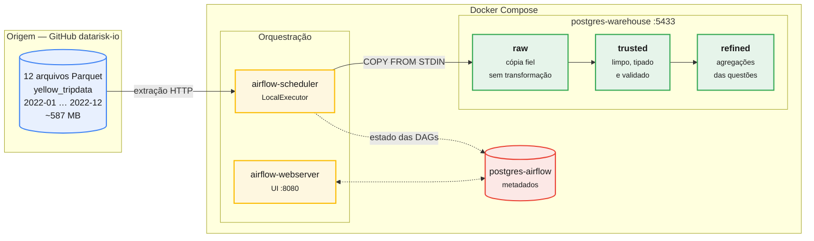
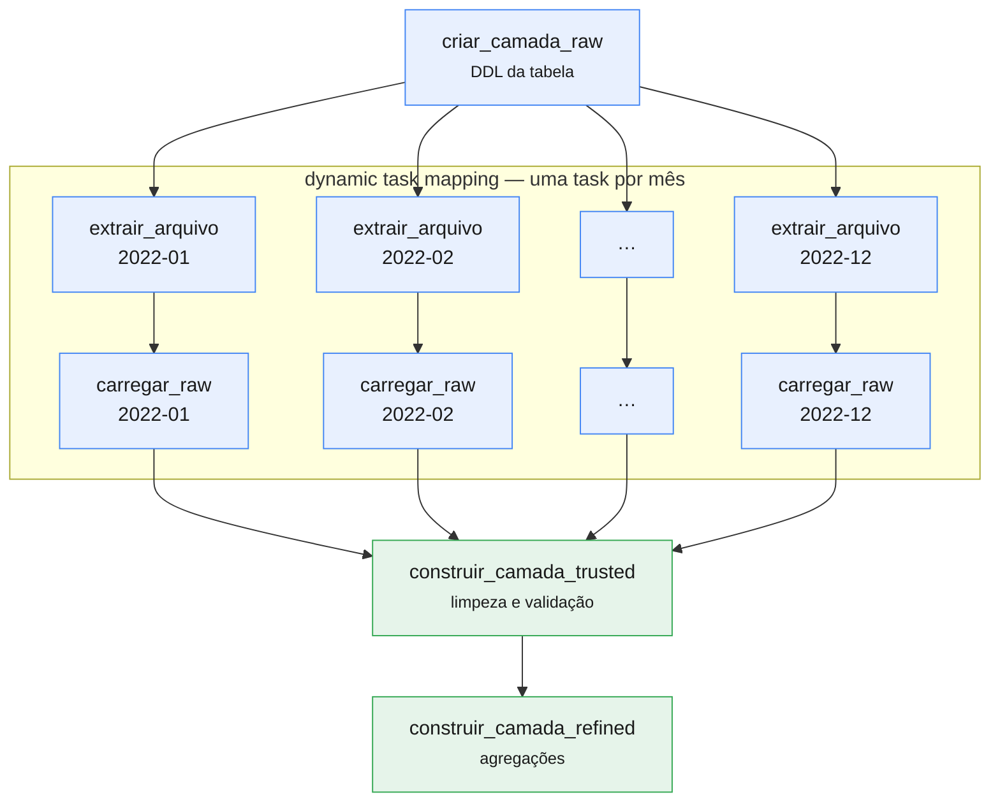

# Desafio de Engenharia de Dados — Datarisk

Pipeline de ETL das corridas de táxi amarelo de Nova York (ano de 2022),
orquestrado em Apache Airflow e armazenado em PostgreSQL, com os dados
organizados em três camadas de processamento.

---

## Sumário

- [Arquitetura](#arquitetura)
- [Como executar](#como-executar)
- [O pipeline](#o-pipeline)
- [Decisões de projeto](#decisões-de-projeto)
- [Respostas às questões](#respostas-às-questões)
- [Problemas encontrados](#problemas-encontrados)
- [Estrutura do repositório](#estrutura-do-repositório)

---

## Arquitetura



Quatro containers no total. Dois bancos PostgreSQL separados, deliberadamente:
um para os metadados do Airflow e outro para o data warehouse. Misturar os dois
acoplaria o ciclo de vida da orquestração ao dos dados — reinstalar o Airflow
não deve colocar o warehouse em risco.

### As três camadas

| Camada    | Conteúdo                                             | Transformação |
|-----------|------------------------------------------------------|---------------|
| `raw`     | Cópia fiel dos arquivos de origem                    | Nenhuma       |
| `trusted` | Dados limpos, tipados e validados                    | Limpeza e tipagem |
| `refined` | Agregações que respondem às questões                 | Agregação     |

A camada `raw` não rejeita nenhum registro, nem mesmo os absurdos. Isso é
proposital: quando um número da `refined` parece errado, é possível descer até
a `raw` e comparar com o dado original sem baixar os arquivos de novo.

---

## Como executar

### Pré-requisitos

- Docker e Docker Compose
- ~20 GB livres em disco
- Virtualização habilitada na BIOS (`SVM Mode` em CPUs AMD, `VT-x` em Intel) —
  sem isso o WSL2 não inicia e o Docker não sobe

### Passos

```bash
cd challenge

# Sobe a stack (o primeiro build leva alguns minutos)
docker compose up -d

# Acompanha até os containers ficarem saudáveis
docker compose ps
```

A interface do Airflow fica em <http://localhost:8080> — usuário `airflow`,
senha `airflow`. O warehouse fica exposto em `localhost:5433` para inspeção via
`psql` ou DBeaver.

```bash
# Dispara o pipeline
docker compose exec airflow-scheduler airflow dags unpause etl_nyc_taxi
docker compose exec airflow-scheduler airflow dags trigger etl_nyc_taxi
```

Ao final, as respostas das questões:

```bash
docker compose exec postgres-warehouse \
  psql -U datarisk -d nyc_taxi -f /opt/airflow/sql/05_respostas.sql
```

---

## O pipeline

A DAG `etl_nyc_taxi` tem quatro etapas:



As etapas de extração e carga usam **dynamic task mapping** (`.expand()`): o
Airflow cria uma task por mês em tempo de execução. Isso dá granularidade de
reprocessamento — se apenas o arquivo de março falhar, só essa task precisa ser
reexecutada, não o ano inteiro.

A carga é **idempotente**: antes de inserir, cada task remove os registros do
seu próprio arquivo de origem (`DELETE ... WHERE arquivo_origem = ...`).
Reexecutar uma task não duplica dados.

---

## Decisões de projeto

### LocalExecutor em vez de CeleryExecutor

O `docker-compose.yaml` oficial do Airflow sobe oito serviços com
CeleryExecutor: webserver, scheduler, triggerer, worker, flower, redis, postgres
e init. Para uma carga em lote numa máquina só, isso é custo de memória sem
contrapartida — Celery existe para distribuir tarefas entre máquinas, e aqui só
há uma. O LocalExecutor paraleliza em subprocessos do próprio scheduler e
entrega o mesmo resultado com metade dos containers.

### `COPY FROM STDIN` em vez de `pandas.to_sql()`

Com ~39 milhões de registros, o método de carga é a decisão de performance mais
importante do projeto. `to_sql()` gera INSERTs; `COPY` é o caminho nativo de
carga em massa do PostgreSQL.

Medido nesta máquina: **~80.000 linhas/s** com `COPY`, contra ~49.000 linhas/s
na primeira versão. A carga completa do ano leva cerca de 8 minutos.

Houve também um motivo técnico: o pandas 2.2 exige SQLAlchemy ≥ 2.0, enquanto o
Airflow 2.9 fixa SQLAlchemy < 2.0. Nesse cenário o pandas ignora o SQLAlchemy
silenciosamente, trata o `Engine` como conexão DBAPI e falha com
`'Engine' object has no attribute 'cursor'`. Usar `psycopg2` diretamente resolve
o conflito e ainda entrega a carga mais rápida.

### Leitura do parquet em lotes

Os arquivos maiores passam de 3,5 milhões de linhas. `pq.ParquetFile.iter_batches()`
lê em lotes de 100 mil registros, mantendo o consumo de memória previsível em
vez de materializar o arquivo inteiro.

### Lógica de carga fora do decorador `@task`

A função `carregar_parquet_em_raw()` é uma função de módulo, e a task é apenas
um wrapper fino sobre ela. Lógica dentro do decorador só roda com um contexto de
Airflow montado, o que torna qualquer teste caro. Como função de módulo, ela é
importável e testável isoladamente.

### A chave sintética da camada trusted, e um sort que custou caro

O dataset de origem não traz identificador de viagem, então a `trusted.viagens`
gera um `viagem_id` próprio. A primeira versão usava:

```sql
ROW_NUMBER() OVER (ORDER BY tpep_pickup_datetime, pu_location_id, do_location_id)
```

O `ORDER BY` força a ordenação completa das ~39 milhões de linhas. Medido em
execução: **2,5 GB de arquivos temporários** em disco e vários minutos de merge
externo, com o processo consumindo mais de 5 GB de RAM. Numa máquina de 16 GB
isso contribuiu para travar o host.

A versão final usa `ROW_NUMBER() OVER ()`, sem ordenação. A chave continua única
e estável; perde-se apenas a correlação entre a ordem do id e a linha do tempo —
que nenhuma consulta deste projeto usa, já que a ordenação cronológica vem de
`datahora_inicio`, que é indexada.

A lição vale além deste projeto: `ORDER BY` dentro de uma window function sobre
tabela grande é uma ordenação total disfarçada de detalhe cosmético.

### Critérios de limpeza da camada trusted

O dataset público do NYC TLC é notoriamente sujo. Cada filtro aplicado na
`trusted` tem uma justificativa registrada em [`sql/03_trusted.sql`](sql/03_trusted.sql):

| # | Critério | Motivo |
|---|----------|--------|
| 1 | Datas de embarque e desembarque não nulas | Sem elas a viagem não é localizável no tempo |
| 2 | Desembarque posterior ao embarque | Há registros que produziriam duração negativa |
| 3 | Embarque dentro de 2022 | Existem registros com datas de 2001, 2008 e até 2098 |
| 4 | Distância maior que zero | Zero indica corrida cancelada ou erro de taxímetro |
| 5 | Distância até 1.000 milhas | Há valores como 389.678 milhas — defeito de hodômetro |
| 6 | Duração entre 1 minuto e 24 horas | Descarta taxímetro esquecido ligado por dias |
| 7 | Valor total não negativo | Valores negativos são estornos, não corridas |

O filtro 5 merece atenção: as questões 3 e 4 são justamente sobre distância, e
sem esse corte a resposta seria dominada por um registro defeituoso. O limite de
1.000 milhas é generoso o bastante para preservar viagens interestaduais
legítimas.

**Nenhum desses registros é perdido** — todos continuam na camada `raw`. A taxa
de descarte é medida e registrada em log a cada execução.

---

## Respostas às questões

> Os números abaixo referem-se à camada `trusted` (dados validados), salvo onde
> indicado. As queries completas estão em [`sql/05_respostas.sql`](sql/05_respostas.sql).

_(preenchido após a execução)_

---

## Problemas encontrados

Esta seção documenta os obstáculos reais do desenvolvimento, já que o enunciado
antecipa que eles apareceriam.

### 1. Docker não subia: virtualização desabilitada na BIOS

O Docker Desktop falhava com `Docker Desktop distro installation failed` e, em
seguida, `WSL2 is unable to start`. A investigação mostrou que o WSL2 não
iniciava **nenhuma** distribuição:

```
Wsl/Service/CreateInstance/CreateVm/HCS/HCS_E_HYPERV_NOT_INSTALLED
```

Confirmado via `Get-CimInstance Win32_Processor`:

```
VirtualizationFirmwareEnabled : False   ← SVM desligado
VMMonitorModeExtensions       : True    ← a CPU suporta
```

A causa foi uma atualização de BIOS que restaurou os padrões de fábrica, nos
quais o `SVM Mode` vem desabilitado. Resolvido habilitando `SVM Mode` na BIOS.

### 2. Backend do Docker em loop de crash por um socket órfão

Mesmo com a virtualização ativa, o daemon não subia. O log do backend revelou:

```
backend cancelling with error: running OTel manager:
removing stale socket: userAnalyticsOtlpHttp.sock:
The file cannot be accessed by the system
```

Um socket AF_UNIX de 0 byte, deixado pelo crash anterior, impedia o backend de
inicializar — e ele derrubava o engine junto. O arquivo não podia ser removido
nem por `Remove-Item` nem por `del`. Resolvido renomeando o diretório
`%LOCALAPPDATA%\Docker\run`, que o Docker recria no start seguinte.

### 3. Arquivos `.parquet.gz` que não são gzip

Os arquivos do repositório têm extensão `.gz`, mas não estão comprimidos:

```python
Content-Encoding: None
bytes na rede: b'PAR1\x15\x04\x15@'   # assinatura do Parquet
```

`gzip.open()` falhava com `BadGzipFile: Not a gzipped file (b'PA')`. A extração
passou a detectar o formato pelos **magic bytes** em vez de confiar na extensão,
tratando os dois casos — se os arquivos forem recomprimidos no futuro, o
pipeline continua funcionando.

### 4. PostgreSQL não funciona em bind mount do Windows

Uma versão inicial apontava o diretório de dados do warehouse para o drive `D:`,
buscando espaço livre. O banco caía no meio da carga:

```
ERROR: could not extend file ... with FileFallocate(): Interrupted system call
PANIC: could not write to file "pg_wal/xlogtemp": Interrupted system call
server process was terminated by signal 6: Aborted
```

No WSL2 os drives do Windows são expostos via 9p/drvfs, que não oferece as
garantias POSIX que o PostgreSQL exige de `fallocate` e `fsync`. Revertido para
volume nomeado, que fica no ext4 dentro do VHDX do WSL2. Além de corrigir a
falha, a carga ficou **63% mais rápida** (de 49k para 80k linhas/s).

---

## Estrutura do repositório

```
challenge/
├── dags/
│   └── etl_nyc_taxi.py        # DAG completa do pipeline
├── sql/
│   ├── init/
│   │   └── 01_schemas.sql     # Criação dos schemas (roda no init do container)
│   ├── 02_raw_tables.sql      # DDL da camada raw
│   ├── 03_trusted.sql         # Limpeza e validação
│   ├── 04_refined.sql         # Agregações
│   └── 05_respostas.sql       # Queries das quatro questões
├── data/                      # Parquets baixados (não versionado)
├── logs/                      # Logs do Airflow (não versionado)
├── docker-compose.yaml
├── Dockerfile
├── requirements.txt
└── README.md
```

### Padrões de código

O código Python segue o guia de estilo do projeto: docstrings no padrão NumPy em
português, type hints em todas as assinaturas, `logging` em vez de `print()`, e
operações vetorizadas do pandas (sem `iterrows()`). Validado com `ruff`:

```bash
docker run --rm -v "$(pwd):/work" -w /work \
  ghcr.io/astral-sh/ruff:latest check dags/ --line-length 88
# All checks passed!
```
